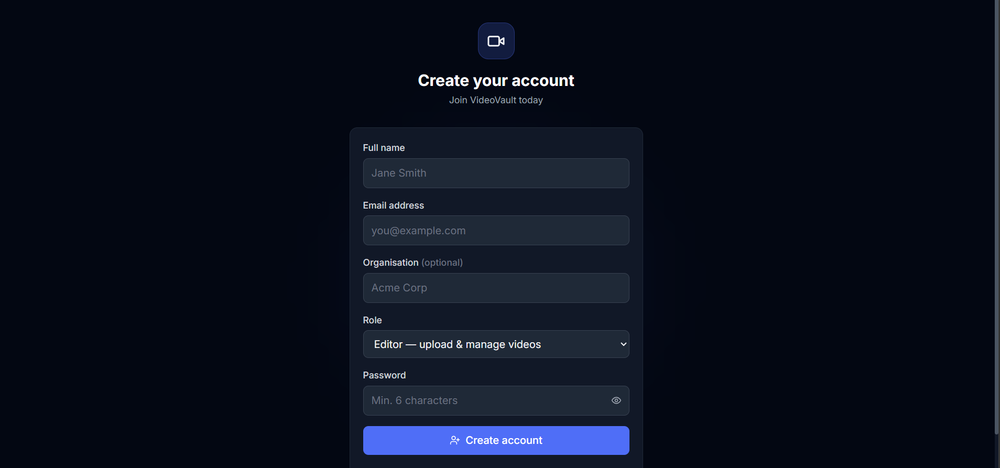
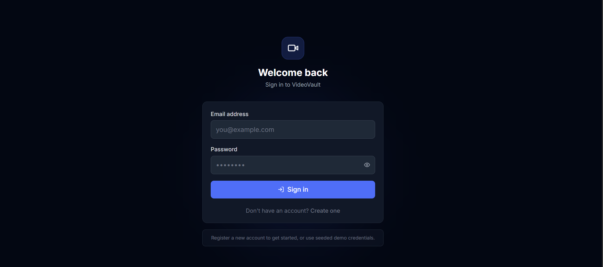
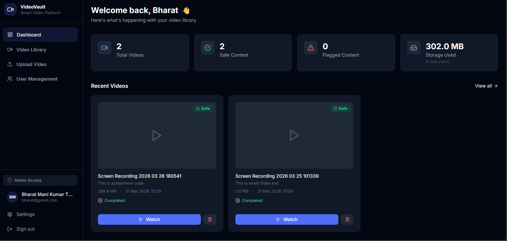
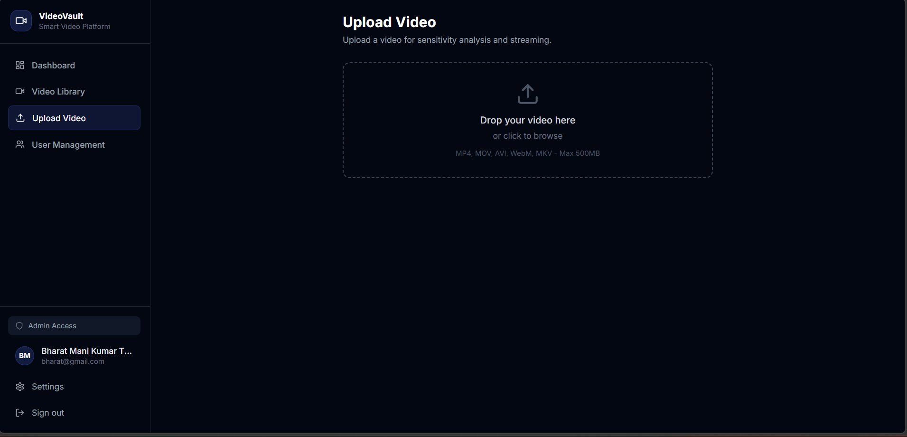
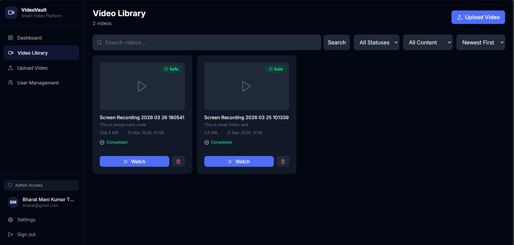
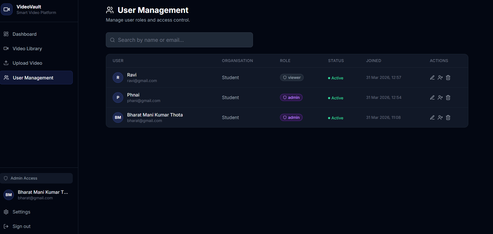

# VideoVault — Full-Stack Video Platform

A comprehensive full-stack application for video upload, content sensitivity analysis, and HTTP streaming with real-time progress updates.

---

## Tech Stack

| Layer | Technology |
|---|---|
| Backend Runtime | Node.js (LTS) |
| Backend Framework | Express.js |
| Database | MongoDB + Mongoose |
| Real-Time | Socket.io |
| Auth | JWT (jsonwebtoken + bcryptjs) |
| File Upload | Multer |
| Frontend Build | Vite |
| Frontend Framework | React 18 |
| Styling | Tailwind CSS |
| HTTP Client | Axios |
| Real-Time Client | Socket.io-client |

---

## Project Structure

```
project/
├── backend/
│   ├── server.js                  # Express + Socket.io entry point
│   ├── package.json
│   ├── .env.example
│   └── src/
│       ├── config/
│       │   └── db.js              # MongoDB connection
│       ├── models/
│       │   ├── User.js            # User schema (RBAC)
│       │   └── Video.js           # Video schema (processing, sensitivity)
│       ├── middleware/
│       │   ├── auth.js            # JWT protect + restrictTo
│       │   ├── upload.js          # Multer file handler
│       │   └── errorHandler.js    # Global error handler
│       ├── controllers/
│       │   ├── authController.js  # Register, login, profile
│       │   ├── videoController.js # CRUD, stream, stats
│       │   └── userController.js  # Admin user management
│       ├── routes/
│       │   ├── auth.js
│       │   ├── videos.js
│       │   └── users.js
│       ├── services/
│       │   └── sensitivityService.js  # Video analysis pipeline
│       ├── socket/
│       │   └── socketHandler.js   # Authenticated Socket.io handler
│       └── __tests__/
│           └── api.test.js
└── frontend/
    ├── index.html
    ├── vite.config.js
    ├── tailwind.config.js
    └── src/
        ├── App.jsx                # Router + providers
        ├── main.jsx
        ├── index.css              # Tailwind + global styles
        ├── context/
        │   ├── AuthContext.jsx    # Auth state + JWT management
        │   └── VideoContext.jsx   # Video list + Socket events
        ├── services/
        │   ├── api.js             # Axios instance + all API calls
        │   └── socket.js          # Socket.io client management
        ├── utils/
        │   └── helpers.js         # Formatting utilities
        ├── components/
        │   ├── Layout/
        │   │   ├── AppLayout.jsx
        │   │   ├── Sidebar.jsx
        │   │   └── ProtectedRoute.jsx
        │   └── Video/
        │       └── VideoCard.jsx
        └── pages/
            ├── Login.jsx
            ├── Register.jsx
            ├── Dashboard.jsx
            ├── VideoLibrary.jsx
            ├── VideoDetail.jsx
            ├── Upload.jsx
            ├── AdminUsers.jsx
            └── Settings.jsx
```

---

## Setup & Installation

### Prerequisites
- Node.js 18+ (LTS)
- MongoDB (local or Atlas)
- npm or yarn

### 1. Clone the repository
```bash
git clone <your-repo-url>
cd project
```

### 2. Backend setup
```bash
cd backend
npm install

# Copy and configure environment variables
cp .env.example .env
# Edit .env with your MongoDB URI, JWT secret, etc.

npm run dev   # Development (nodemon)
npm start     # Production
```

### 3. Frontend setup
```bash
cd frontend
npm install
npm run dev   # Vite dev server on http://localhost:5173
npm run build # Production build
```

---

## Environment Variables

```env
PORT=5000
NODE_ENV=development
MONGODB_URI=mongodb://localhost:27017/videoplatform
JWT_SECRET=change_this_to_a_strong_secret
JWT_EXPIRES_IN=7d
UPLOAD_PATH=./uploads
MAX_FILE_SIZE=524288000        # 500MB in bytes
CLIENT_URL=http://localhost:5173
```

## Register



## Register



##  Dashboard




## 📤 Upload Page



##  Player



## User Management




## API Documentation

### Authentication

| Method | Endpoint | Access | Description |
|--------|----------|--------|-------------|
| POST | `/api/auth/register` | Public | Register new user |
| POST | `/api/auth/login` | Public | Login and get JWT |
| GET | `/api/auth/me` | Private | Get current user |
| PUT | `/api/auth/me` | Private | Update profile |
| PUT | `/api/auth/change-password` | Private | Change password |

### Videos

| Method | Endpoint | Access | Description |
|--------|----------|--------|-------------|
| GET | `/api/videos` | Private | List videos (with filters) |
| POST | `/api/videos/upload` | Editor/Admin | Upload video |
| GET | `/api/videos/stats` | Private | Dashboard statistics |
| GET | `/api/videos/:id` | Private | Get single video |
| PUT | `/api/videos/:id` | Editor/Admin | Update video metadata |
| DELETE | `/api/videos/:id` | Editor/Admin | Delete video |
| GET | `/api/videos/:id/stream` | Private | Stream video (range requests) |
| GET | `/api/videos/:id/status` | Private | Polling status endpoint |

#### Video List Query Parameters
- `page` — Page number (default: 1)
- `limit` — Items per page (default: 12)
- `status` — Filter by: `pending | processing | completed | failed`
- `sensitivityResult` — Filter by: `safe | flagged`
- `search` — Full-text search on title, description, tags
- `sortBy` — Sort field (default: `createdAt`)
- `sortOrder` — `asc | desc` (default: `desc`)
- `category` — Filter by category
- `tags` — Comma-separated tags

### Users (Admin only)

| Method | Endpoint | Access | Description |
|--------|----------|--------|-------------|
| GET | `/api/users` | Admin | List all org users |
| GET | `/api/users/:id` | Admin | Get user |
| PUT | `/api/users/:id` | Admin | Update role/status |
| DELETE | `/api/users/:id` | Admin | Delete user |

---

## Role-Based Access Control

| Role | Capabilities |
|------|-------------|
| **viewer** | Browse and stream videos they have access to |
| **editor** | Upload, manage, delete their own videos |
| **admin** | Full access: all org videos, user management, system settings |

---

## Real-Time Events (Socket.io)

After authenticating, the client receives live processing updates.

### Client → Server
| Event | Payload | Description |
|-------|---------|-------------|
| `subscribe:video` | `videoId` | Subscribe to a specific video's updates |
| `unsubscribe:video` | `videoId` | Unsubscribe |

### Server → Client
| Event | Payload | Description |
|-------|---------|-------------|
| `connected` | `{ userId }` | Confirmed connection |
| `video:update` | `{ videoId, progress, status }` | General progress broadcast |
| `video:progress:<id>` | `{ progress, message, status }` | Per-video progress |
| `video:result:<id>` | `{ status, sensitivityResult, score }` | Final analysis result |

---

## Video Processing Pipeline

```
Upload → Validate format/size → Store file → Create DB record
  → [Background] sensitivityService.processVideo()
      ├── 0%   — Starting analysis
      ├── 10%  — Validating video format
      ├── 25%  — Extracting metadata
      ├── 40%  — Sampling key frames
      ├── 60%  — Running sensitivity models
      ├── 80%  — Aggregating scores
      ├── 95%  — Finalising results
      └── 100% — Complete → safe | flagged
```

**Note:** The sensitivity analysis is simulated using randomised ML-like scores. In production, integrate with AWS Rekognition Video, Google Video Intelligence API, or a custom ML model.

---

## Multi-Tenant Architecture

- Each user belongs to an **organisation**
- **Editors** see only their own videos
- **Admins** see all videos within their organisation
- Video files are stored in per-user directories: `uploads/<userId>/<uuid>.<ext>`

---

## Streaming Implementation

HTTP Range Request streaming is implemented natively:

```
GET /api/videos/:id/stream
Headers: Range: bytes=0-1048575

→ 206 Partial Content
   Content-Range: bytes 0-1048575/10485760
   Content-Type: video/mp4
   [Binary chunk]
```

This enables:
- Native browser `<video>` seeking
- Bandwidth-efficient playback
- Resume-on-reconnect

---

## Running Tests

```bash
cd backend
npm test
```

Tests cover: user registration, login, JWT authentication, protected routes, video listing, and health check.

---

## Deployment

### Backend (e.g. Railway, Render, Heroku)
Backend Url: https://project-lzmm.onrender.com/api
1. Set all environment variables
2. `npm start`
3. Ensure MongoDB Atlas URI is set

### Frontend (e.g. Vercel, Netlify)
Netlify Link: https://videoassignmenet.netlify.app/login
1. Set `VITE_API_URL` if backend is on a different domain
2. Update `vite.config.js` proxy or use absolute API URL
3. `npm run build` → deploy `dist/`

---

## Assumptions & Design Decisions

1. **Sensitivity simulation**: Real ML inference requires a cloud API key. The service uses deterministic randomisation to simulate the pipeline timing and score structure, making it easy to swap in a real API.

2. **Local file storage**: Files are stored on disk (`./uploads/`). For production, swap `multer.diskStorage` for `multer-s3` and point at an S3 bucket.

3. **JWT in localStorage**: For simplicity. In high-security contexts, use httpOnly cookies.

4. **FFmpeg not required**: Metadata extraction is mocked. Add `fluent-ffmpeg` integration in `sensitivityService.js` to extract real duration/resolution.

5. **Organisation = registration field**: Users choose their organisation at signup. An invite-based system would be more secure for production.
